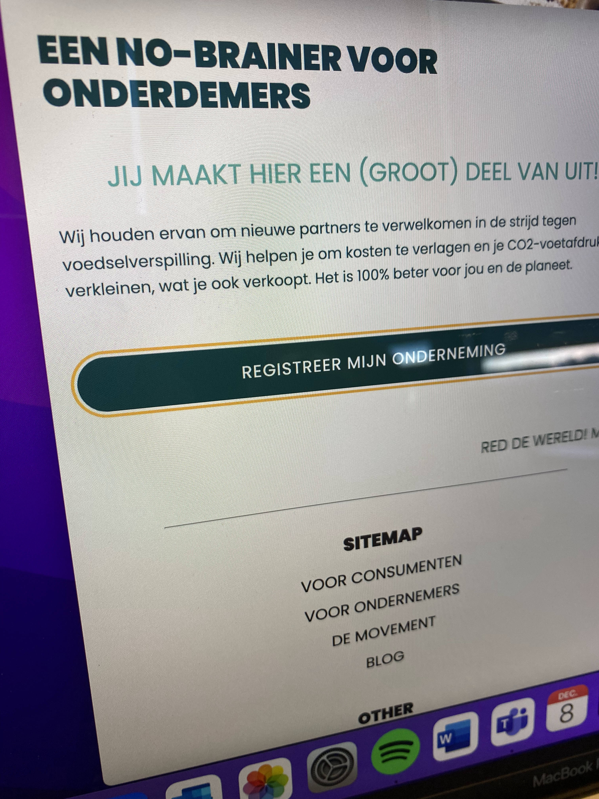

# Procesverslag
Door *open* toe te voegen aan een *details* element kun je deze standaard open zetten. Fijn om dat steeds voor de relevante stuk(ken) te doen.

## Jij

uitwerken voor kick-off werkgroep

### Auteur:
Sofie Berger

#### Je startniveau:
Blauw, maar rood ga ik ook zeker proberen!

#### Je focus:
Responsive
 

## Je website

uitwerken voor kick-off werkgroep

### Je opdracht:
https://toogoodtogo.nl/nl

#### Screenshot(s) van de eerste pagina (small screen): 
Homepagina

#### Screenshot(s) van de tweede pagina (small screen):
Voor ondernemers

 

## Breakdownschets (week 1)

uitwerken na afloop 2e werkgroep

### de hele pagina: 

### dynamisch deel (homepagina): 

### dynamisch deel (ondernemers): 

## Voortgang 1 (week 2)

uitwerken voor 1e voortgang

### Stand van zaken
hier dit ging goed & dit was lastig
- de huisstijl toepassen was makkelijk. De html zag er gelijk al goed uit! 

- Ik had problemen met de apple en play store button styling. Uiteindelijk heb ik dit opgelost door de buttons in een aparte div te doen. De styling van de buttons werd in de section namelijk steeds overschreven door een stekere selector.

### Agenda voor meeting
samen met je groepje opstellen

| Romy  |
Hoe kan ik ervoor zorgen dat de tekst in een cirkel blijft staan, ook bij een groter schermformaat?
| Hidde  |
Hoe zorg ik ervoor dat de button tegen de img aan staat?
| Sofie  |
Kan ik switchen van responsive naar surface plane?
Wat houdt de state van control in?

### Verslag van meeting
hier na afloop snel de uitkomsten van de meeting vastleggen

- Ik kan switchen naar surface plane.
- De states van de controls houden in dat je de hover/active/focus state een styling geeft. Dit gaan we in een latere les nog veranderen.

## Voortgang 2 (week 3)

uitwerken voor 2e voortgang

### Stand van zaken
Ik had als tweede pagina de blog pagina gemaakt. Achteraf vond ik dat deze pagina te makkelijk was qua verschillende soorten content. Dus ik heb een andere pagina gemaakt.

### Agenda voor meeting
samen met je groepje opstellen

| Romy  |
Geen punten
| Hidde |
Hamburgermenu lukt niet in de stijl van zijn pagina, de streepjes moeten scheef staan.
| Fleur |
Animatie van hamburgermenu speelt af zodra je de site refresht of ergens op klikt.
| Sofie |
Ik wil iconen in mijn formulier gebruiken, hoe krijg ik deze in het input field? Hamburgermenu is verdwenen op de tweede pagina, en ik weet niet waar dit aan ligt.

### Verslag van meeting
hier na afloop snel de uitkomsten van de meeting vastleggen

- De class van de tweede pagina kan beter op de main staan, ipv op de body. Dit zorgt ervoor dat dingen niet overschreven worden.
- De iconen in het formulier plaatsen kan het beste door ze bovenop het formulier te plaatsen

## Toegankelijkheidstest (week 4)

uitwerken na test in 8e voortgang

### Bevindingen
Lijst met je bevindingen die in de test naar voren kwamen:

#### Screenreader
- Het hamburgermenu wordt voorgelezen, zonder dat je deze hebt aangeklikt.
- Bij elke link die wordt voorgelezen zegt de screenreader "bezocht, link, (naam link).
- Alleen de linkjes en buttons worden voorgelezen.
- Label bij het formulier wordt niet opgelezen.
- Er zijn speciale toetscombinaties nodig op de headings, teksten of afbeeldingen te selecteren.

Oplossingen:
- Bij een groter schermformaat een uitgeklapt hamburger menu.
- Instellingen tab-toets anders zetten, zodat alles wordt voorgelezen.
- Label en input dezelfde id geven, zodat ze bij elkaar horen.

#### Gele bril 
- De placeholder in het formulier is wat lastiger te lezen.

Oplossingen:
- Contrast placeholder en input achtergrond groter maken.

#### Ballon
- Focus state om de button heen niet super duidelijk, daarentegen is het contrast van de bijvoobeeld de footer links wel heel groot.

Oplossingen:
- Ander soort foucs state om de buttons heen.

#### Blur bril
- Muis is niet te vinden op het scherm.
- Alleen de H1 is te lezen, alle andere tekst wordt moeijlijk.
- Kleur contrasten zijn wel te zien.

Oplossingen:
- Muis terug vinden kun je instellen op je computer.
- Je kan een ingezoomde en vergrote versie van de site kunnen maken, en deze met een knop kunnen activeren.

#### Parkison apparaat
- Een formulier invullen is echt heel lastig.
- Buttons zijn groot genoeg om op te klikken.

Oplossingen:
- Input velden groter maken.

## Voortgang 3 (week 4)

uitwerken voor 3e voortgang

### Stand van zaken
Beide pagina's heb ik nu af, en nu wil ik vooral gaan kijken naar de extra dingetjes van de surface plane.

### Agenda voor meeting
samen met je groepje opstellen

| Romy  |
Grid responsive maken. Logo altijd in het midden van het scherm weergeven. Menu items in het midden van het scherm.
| Hidde |
Responsive maken naar 2 rijen.
| Fleur |
Footer werkt niet met margin.
| Sofie |
In het hamburgermenu aangeven op welke pagina je zit. Afbeelding heeft dezelfde styling, maar reageert anders.

### Verslag van meeting
hier na afloop snel de uitkomsten van de meeting vastleggen

- In het hamburgermenu aangeven op welke pagina je nu bent is niet gelukt.
- De styling van de afbeelding is opgelost met flex-direction:column

## Eindgesprek (week 5)

uitwerken voor eindgesprek

### Stand van zaken
De html ging echt super goed, en ik kon alles eigenlijk binnen 5 minuten erin zetten. De CSS ging deze keer ook heel goed. Soms had ik wat moeite met positioneren van items, maar dan ga je van alles uitproberen en dan lukt het wel. Ik vind JavaScript nog steeds lastig, en heb dus alleen het minimale gedaan wat nodig was.

## Bronnenlijst

continu bijhouden terwijl je werkt

Nb. Wees specifiek ('css-tricks' als bron is bijv. niet specifiek genoeg).

1. (flexbox) https://css-tricks.com/snippets/css/a-guide-to-flexbox/
2.(fancy borders)  https://9elements.github.io/fancy-border-radius/#34.19.44.26--.
3. (verticale tekst scroll) https://www.youtube.com/watch?v=yCyD5AZegLk&t=16s
4. (SVG animatie) https://www.youtube.com/watch?v=gWai7fYp9PY&t=9s

